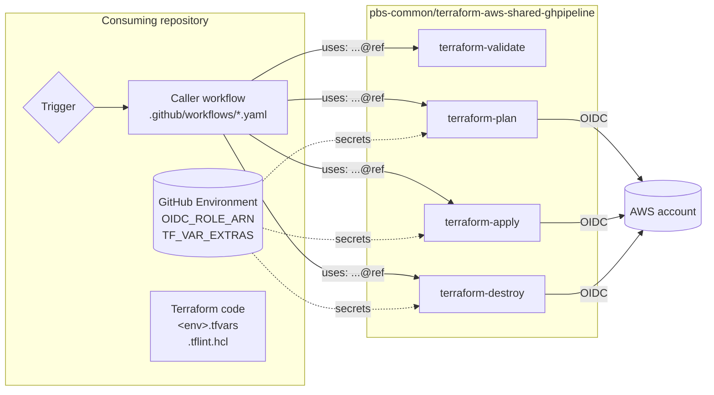
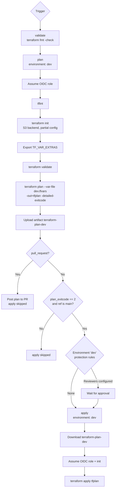

# terraform-aws-shared-ghpipeline

Central repository of reusable GitHub Actions workflows for running Terraform against AWS. Other
repositories in the `pbs-common` organization call these workflows instead of maintaining their
own copies.

Current scope:

| Workflow | Purpose | Touches AWS |
|---|---|---|
| `terraform-validate.yaml` | `terraform fmt -check -recursive` | No |
| `terraform-plan.yaml` | TFLint, init, validate, plan, upload plan artifact, optional PR comment | Yes |
| `terraform-apply.yaml` | Download the saved plan artifact and apply it | Yes |
| `terraform-destroy.yaml` | `terraform destroy -auto-approve` | Yes |

All four are `workflow_call` building blocks. They define no triggers of their own; the consuming
repository owns the triggers (push, pull request, manual dispatch) and decides which jobs run when.

AWS access never uses static keys. Every job that touches AWS assumes an IAM role through GitHub
OIDC, using a role ARN stored as a GitHub Environment secret in the **consuming** repository.

---

## How it fits together



When a consuming repository calls a shared workflow, the job runs in the context of the
**caller**:

- `actions/checkout` checks out the consuming repository, not this one. The `github` context is
  always associated with the caller workflow.
- `environment: <name>` resolves to a GitHub Environment in the consuming repository, so its
  secrets and protection rules (required reviewers, branch restrictions) apply.
- The OIDC token's standard claims (`sub`, `repository`) describe the consuming repository. The
  shared workflow is identified separately in the `job_workflow_ref` claim.
- Plan and apply artifacts live in the caller's workflow run, which is how apply finds the plan.

---

## One-time setup in this repository

1. **Workflow location.** GitHub only resolves reusable workflows from `.github/workflows/`. The
   workflow files must live at `.github/workflows/terraform-*.yaml`.
2. **Access policy.** If this repository is private or internal, go to **Settings > Actions >
   General > Access** and allow access from repositories in the `pbs-common` organization. Without
   this, callers fail with a "workflow was not found" error.
3. **Releases.** Tag releases with semantic versions (`v1.0.0`). Bump the major version for any
   change that adds a required input, removes or renames an input, secret, or output, or changes
   default behavior.

---

## Consuming repository prerequisites

Each consuming repository needs the following before calling the shared workflows.

### Repository layout

```text
.tflint.hcl                  # required at repo root; plan sets TFLINT_CONFIG_FILE to this path
environments/
  dev/
    main.tf
    versions.tf              # backend "s3" { use_lockfile = true }  (partial config)
    dev.tfvars               # name must match the GitHub Environment name
  prod/
    ...
    prod.tfvars
.github/workflows/
  terraform-dev.yaml         # caller workflow(s)
```

| Requirement | Used by | Notes |
|---|---|---|
| `.tflint.hcl` at the repository root | plan | Plan sets `TFLINT_CONFIG_FILE` to `${{ github.workspace }}/.tflint.hcl`. Declare the AWS ruleset plugin here; without it only the bundled Terraform rules run. |
| `<environment>.tfvars` inside `working_directory` | plan, destroy | Passed as `--var-file <environment>.tfvars`. Apply does not read it; values are baked into the saved plan. |
| S3 backend block with partial configuration | plan, apply, destroy | The workflows supply `bucket`, `key`, `region`, and `encrypt=true` at `terraform init`. Set `use_lockfile = true` in code for S3 native locking. |

### GitHub Environments and secrets

Create one GitHub Environment per AWS account under **Settings > Environments** in the consuming
repository. The environment name passed to the shared workflows does three things:

1. Selects that environment's `OIDC_ROLE_ARN`, and therefore the target AWS account.
2. Applies that environment's protection rules to the job.
3. Selects the tfvars file (`<environment>.tfvars`).

| Secret | Required | Purpose |
|---|---|---|
| `OIDC_ROLE_ARN` | Yes | IAM role assumed via OIDC. Store it as an **environment** secret so each environment can only reach its own account. |
| `TF_VAR_EXTRAS` | No | JSON object, e.g. `{"db_password":"..."}`. Each key is exported as `TF_VAR_<key>` before plan, apply, and destroy. Use for values that must not be committed to a `.tfvars` file. |

Pass secrets with `secrets: inherit`. Environment secrets cannot be passed explicitly from a caller
because `on.workflow_call` does not support the `environment` keyword; the shared job declares
`environment:` itself and reads them directly.

Add required reviewers to any production-facing environment. The environment is the **only**
approval gate; the shared workflows contain no in-workflow approval step.

### AWS IAM role trust policy

The role in each account must trust the GitHub OIDC provider and the consuming repository's
environment. Because the job declares an environment, the default `sub` claim has the form:

```text
repo:pbs-common/<consuming-repo>:environment:<environment>
```

Example trust policy condition:

```json
"Condition": {
  "StringEquals": {
    "token.actions.githubusercontent.com:aud": "sts.amazonaws.com",
    "token.actions.githubusercontent.com:sub": "repo:pbs-common/<consuming-repo>:environment:dev"
  }
}
```

### Caller workflow permissions

The caller must grant the `GITHUB_TOKEN` permissions the shared workflows need. A called workflow
can only downgrade permissions, never elevate them.

| Permission | Needed by | Why |
|---|---|---|
| `id-token: write` | plan, apply, destroy | Request the OIDC token for AWS |
| `contents: read` | all | Check out the consuming repository |
| `pull-requests: write` | plan | Post the plan as a PR comment (only when `post_pr_comment` is `true`) |

---

## Referencing the workflows

Call a shared workflow at the job level with `uses:`:

```yaml
uses: pbs-common/terraform-aws-shared-ghpipeline/.github/workflows/<workflow>.yaml@<ref>
```

Pin `<ref>` to a full commit SHA, with the release tag in a trailing comment. Do not reference
`@main`; any merge to this repository would immediately change every consumer's pipeline.

```yaml
uses: pbs-common/terraform-aws-shared-ghpipeline/.github/workflows/terraform-plan.yaml@<commit-sha> # v1.0.0
```

Use the same ref for every shared workflow in a caller. Plan and apply share an artifact format,
so mixing versions between them is unsupported.

---

## Example: validate, plan, apply

A single caller workflow per environment. Pull requests run validate and plan and post the plan to
the PR. Pushes to `main` and manual runs from `main` also apply, but only when the plan has
changes.

```yaml
name: Terraform (dev)

on:
  pull_request:
    branches: [main]
    paths:
      - "environments/dev/**"
      - "modules/**"
      - ".tflint.hcl"
      - ".github/workflows/terraform-dev.yaml"
  push:
    branches: [main]
    paths:
      - "environments/dev/**"
      - "modules/**"
      - ".tflint.hcl"
      - ".github/workflows/terraform-dev.yaml"
  workflow_dispatch:

permissions:
  id-token: write
  contents: read
  pull-requests: write

concurrency:
  group: terraform-dev
  cancel-in-progress: false

jobs:
  validate:
    uses: pbs-common/terraform-aws-shared-ghpipeline/.github/workflows/terraform-validate.yaml@<commit-sha> # v1.0.0
    with:
      working_directory: environments/dev

  plan:
    needs: validate
    uses: pbs-common/terraform-aws-shared-ghpipeline/.github/workflows/terraform-plan.yaml@<commit-sha> # v1.0.0
    with:
      environment: dev
      aws_region: us-east-1
      working_directory: environments/dev
      s3_backend_bucket: <state-bucket>
      s3_backend_key: <project>/dev/terraform.tfstate
    secrets: inherit

  apply:
    needs: plan
    if: >-
      github.ref == 'refs/heads/main' &&
      github.event_name != 'pull_request' &&
      needs.plan.outputs.plan_exitcode == '2'
    uses: pbs-common/terraform-aws-shared-ghpipeline/.github/workflows/terraform-apply.yaml@<commit-sha> # v1.0.0
    with:
      environment: dev
      aws_region: us-east-1
      working_directory: environments/dev
      s3_backend_bucket: <state-bucket>
      s3_backend_key: <project>/dev/terraform.tfstate
    secrets: inherit
```



Key behaviors:

- **Apply consumes the saved plan**, not a fresh one. What was reviewed is exactly what is
  applied. Plan and apply must run in the **same caller workflow run**; apply fails at the
  download step if the plan job was skipped, failed, or ran in a different run.
- **The artifact name is `terraform-plan-<environment>`.** Do not plan the same environment twice
  in one workflow run; the second upload collides with the first.
- **`plan_exitcode` gates apply.** `0` means no changes, `1` means error (the plan job fails), `2`
  means changes pending. Gating on `'2'` avoids running an apply with nothing to do.
- **Use `concurrency`** so two runs cannot plan or apply the same state at once. The S3 lock file
  protects state, but a queued run is clearer than a lock error.

---

## Example: destroy

`terraform-destroy.yaml` runs `terraform destroy --var-file <environment>.tfvars -auto-approve`.
It does not produce or consume a plan and has no confirmation step of its own. The caller must
supply the safeguards: a manual trigger, a typed confirmation, and environment protection rules.

```yaml
name: Terraform Destroy (dev)

on:
  workflow_dispatch:
    inputs:
      confirm:
        description: "Type the environment name (dev) to confirm destroy"
        required: true
        type: string

permissions:
  id-token: write
  contents: read

jobs:
  destroy:
    if: github.ref == 'refs/heads/main' && inputs.confirm == 'dev'
    uses: pbs-common/terraform-aws-shared-ghpipeline/.github/workflows/terraform-destroy.yaml@<commit-sha> # v1.0.0
    with:
      environment: dev
      aws_region: us-east-1
      working_directory: environments/dev
      s3_backend_bucket: <state-bucket>
      s3_backend_key: <project>/dev/terraform.tfstate
    secrets: inherit
```

Keep destroy in its own caller workflow rather than adding it to the plan/apply workflow, so it
can never be triggered by a push or pull request.

`terraform-destroy.yaml` also declares `workflow_dispatch`, but it defines no dispatch inputs and
would run against this repository rather than a consumer. Do not run it from this repository's
Actions tab.

---

## Workflow reference

### `terraform-validate.yaml`

Format check only. No AWS credentials, no environment, no secrets.

| Input | Type | Required | Default | Description |
|---|---|---|---|---|
| `working_directory` | string | No | `.` | Directory passed to `terraform fmt -check -recursive` |
| `terraform_version` | string | No | `1.16.0` | Terraform version |
| `runs_on` | string | No | `ubuntu-latest` | Runner label |

### `terraform-plan.yaml`

TFLint, init, validate, plan, artifact upload, optional PR comment.

| Input | Type | Required | Default | Description |
|---|---|---|---|---|
| `environment` | string | Yes | | GitHub Environment name; also selects `<environment>.tfvars` |
| `aws_region` | string | Yes | | AWS region for credentials and the S3 backend |
| `working_directory` | string | Yes | | Directory containing the Terraform root module |
| `s3_backend_bucket` | string | Yes | | S3 bucket holding state |
| `s3_backend_key` | string | Yes | | State object key |
| `terraform_version` | string | No | `1.16.0` | Terraform version |
| `tflint_version` | string | No | `0.64.0` | TFLint version |
| `post_pr_comment` | boolean | No | `true` | Post the plan as a PR comment on `pull_request` events |
| `retention_days` | number | No | `7` | Plan artifact retention |
| `runs_on` | string | No | `ubuntu-latest` | Runner label |

| Secret | Required |
|---|---|
| `OIDC_ROLE_ARN` | Yes |
| `TF_VAR_EXTRAS` | No |

| Output | Description |
|---|---|
| `plan_exitcode` | `0` no changes, `1` error, `2` changes pending |

### `terraform-apply.yaml`

Downloads `terraform-plan-<environment>` from the current run and runs `terraform apply tfplan`.

| Input | Type | Required | Default | Description |
|---|---|---|---|---|
| `environment` | string | Yes | | Must match the value passed to plan |
| `aws_region` | string | Yes | | AWS region |
| `working_directory` | string | Yes | | Must match the value passed to plan |
| `s3_backend_bucket` | string | Yes | | S3 bucket holding state |
| `s3_backend_key` | string | Yes | | State object key |
| `terraform_version` | string | No | `1.16.0` | Must match the version used by plan |
| `runs_on` | string | No | `ubuntu-latest` | Runner label |

Secrets: `OIDC_ROLE_ARN` (required), `TF_VAR_EXTRAS` (optional).

### `terraform-destroy.yaml`

Same inputs and secrets as apply. Reads `<environment>.tfvars` from `working_directory`.

---

## Troubleshooting

| Symptom | Cause |
|---|---|
| Caller fails with "workflow was not found" or "not allowed" | The **Access** policy on this repository does not allow the caller, the `uses:` path is not under `.github/workflows/`, or the ref does not exist. |
| `Not authorized to perform sts:AssumeRoleWithWebIdentity` | The role's trust policy does not match `repo:pbs-common/<consuming-repo>:environment:<environment>`, or `OIDC_ROLE_ARN` points at the wrong account. |
| OIDC token request fails | The caller workflow does not grant `id-token: write`. |
| Plan comment step fails with `Resource not accessible by integration` | The caller does not grant `pull-requests: write`. Grant it or set `post_pr_comment: false`. |
| TFLint fails to load config | `.tflint.hcl` is missing from the consuming repository's root. |
| Plan fails with a missing variable | The value belongs in `<environment>.tfvars` or in that environment's `TF_VAR_EXTRAS`. |
| Apply fails at "Download Terraform Plan Artifact" | Plan was skipped or failed in this run, `environment` differs between plan and apply, or the artifact expired. Re-run the whole caller workflow. |
| Job stuck on "Waiting for review" | Environment protection rule in the consuming repository. A configured reviewer must approve it from the run summary. |
| `terraform fmt -check` fails | Run `terraform fmt -recursive` locally and commit. |
| State lock error | Another run holds the S3 lock, or a cancelled run left a lock file next to the state object. |
